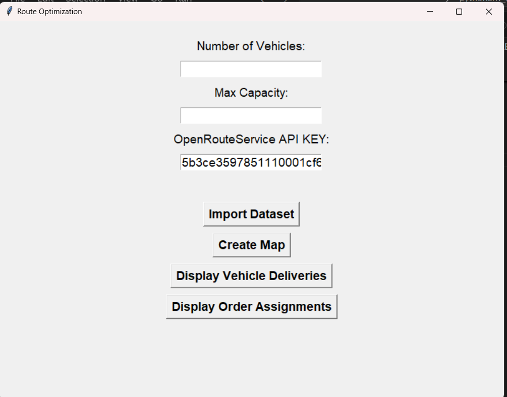

# Route-Optimization-ORS

project นี้ใช้งาน Machine Learning (Kmean Clustering sklearn) และ ORS API (openrouteservice) แก้ไขปัญหา Vehicle Problem (VP) 
ต้องการการจัดกลุ่มสินค้าที่จัดส่งให้รถขนส่งและสร้างเส้นทางขนส่งสินค้า โปรเจ็คสามารถระบุสินค้าชิ้นขนส่งโดยรถคันใด (โดยใช้งาน Kmean Clustering) และ สร้างแผนที่รูปแบบ HTML แสดงเส้นทางเดินทางที่มีประสิทธิภาพ (ใช้งาน ORS API)

## Requirements (Libraries)
== python 3.10.11 == 
```
altgraph                  0.17.4
branca                    0.7.2
certifi                   2024.7.4
charset-normalizer        3.3.2
folium                    0.17.0
idna                      3.7
imbalanced-learn          0.12.3
imblearn                  0.0
Jinja2                    3.1.4
joblib                    1.4.2
MarkupSafe                2.1.5
numpy                     2.0.0
openrouteservice          2.3.3
packaging                 24.1
pandas                    2.2.2
pefile                    2023.2.7
pip                       24.1.2
pyinstaller               6.9.0
pyinstaller-hooks-contrib 2024.7
python-dateutil           2.9.0.post0
pytz                      2024.1
pywin32-ctypes            0.2.2
requests                  2.32.3
scikit-learn              1.5.1
scipy                     1.14.0
setuptools                65.5.0
six                       1.16.0
threadpoolctl             3.5.0
tzdata                    2024.1
urllib3                   2.2.2
xyzservices               2024.6.0
```
## Usage
1. เริ่มใช้งานเริ่มต้นเปิดใช้งานโปรแกรมชื่อไฟล์ main.exe
หมายเหตุ Source Code โปรแกรมจัดเก็บภายในไฟล์ main.py 





### UI details

1. Number of Vehicles (optional) ระบุจำนวนรถที่ใช้ขนส่ง ผู้ใช้งานไม่จำเป็นต้องระบุโปรแกรมทุกครั้ง

2.  Max Capacity (Require) ระบุน้ำหนักที่รถขนส่งหนึ่งสามารถบรรทุกได้ 1 คัน น้ำหนักหน่วยกิโลกรัม (กก.) 

3. OpenRouteSerive API KEY (Require) โปรแกรมที่พัฒนาได้ใช้งาน OpenRouteService ในการประมวลผลเส้นทางการขนส่ง ผู้ใช้งานอาจจะต้องนำ API KEY ที่สมัครจาก OpenRouteService.org ตามลิ้งดัวกล่าวนำมาใช้งาน https://openrouteservice.org/dev/#/login

4. Import Dataset (Require) ผู้ใช้งานนำเข้าข้อมูลเกี่ยวกับสินค้าที่ขนส่งสู่โปรแกรม Format ข้อบังคับไฟล์ Dataset จำเป็น file.csv ที่มีรายละเอียด และชื่อคอลัมน์ตรงกับตัวอย่าง Dataset ชื่อไฟล์ orders_16Jul2024_v2.xlsx - Sheet1.csv 


5. Create Map โปรแกรมที่พัฒนาแสดงแผนที่รูปแบบไฟล์ HTML แสดงรายละเอียดการขนส่งและเส้นทางการเดินรถขนส่ง ซึ่งจะบันทึกตำแหน่ง Folder / Directory ระดับเดียวกับ main.exe ชื่อไฟล์ vehicle_routes.html และแสดงแผนที่บน Web browser ด้วยเช่นกัน


***หมายเหตุ ถ้าโปรแกรมทำงานผิดพลาด กรุณาอ่านรายละเอียดดังนี้ การทำงานโปรแกรมประกอบด้วยขั้นตอนการทำงาน 2 ขั้นตอน***

1. การจัดกลุ่มสินค้าโดยใช้งาน Machine Learning (Kmean Clustering) จะจัดกลุ่มสินค้าด้วย Algorithm k-nearest neighbors (KNN) โดยใช้ค่าพิกัด ละติจูด ลองจิจูด ประมวลผลด้วย Library Sci-kit learn

จากการพัฒนาโปรแกรม Algorithm Kmean Clustering ที่นำมาใช้อาจจะยังไม่มีความเหมาะสมกับการจัดกลุ่ม โปรแกรมจัดกลุ่มยังประมวลไม่มีประสิทธิกับการจัดกลุ่มมากพอ เพราะ ข้อมูลสินค้ากลุ่มต่างจังหวัดที่อยู่ต่างภูมิภาค แต่ Algorithm จัดภายในกลุ่มเดียวกันซึ่งทำให้ระยะการขนส่งมีระยะทางที่มาก และไม่มีประสิทธิภาพ

2. การจัดการเส้นทางการขนส่ง เรียกใช้งาน openRouteService (ORS) API นำเส้นทางไป Plot บน Map  

จากการพัฒนาโปรแกรม เรียกใช้งาน features optimization จาก ORS การประมวลผข้อมูลเพื่อได้เส้นทางขนส่ง ซึ่งมีข้อกำจัดการใช้งาน เช่น API ที่ response ไม่สามารถจัดทำเส้นทางการขนส่งของรถบ้างคันจึงไม่แสดงเส้นทางการขนส่งบนแผนที่

6. Display Vehicle Deliveries แสดงรายละเอียดสินค้าที่จัดส่ง ของแต่ละรถขนส่ง บอกรายละเอียดเกี่ยวกับสินค้าตำแหน่งพิกัด และน้ำหนักรายการสินค้า สามารถบันทึกรายละเอียดเป็นรูปแบบ csv file ได้


7. Display Order Assignments แสดงรายละเอียดรายการสินค้าถูกจัดส่งโดยรถขนส่งใด  สามารถบันทึกรายละเอียดเป็นรูปแบบ csv file ได้


## Future Work
1. การแก้ไข Algorithm การจัดกลุ่มสินค้า ก่อนนำไปประมวลหาเส้นทางขนส่ง แนวทางปรับปรุง Algorithm ปัจจุบันหรือ เปลี่ยน
2. การแก้ไขการเรียกใช้ ORS API แก้ไขให้ประมวลหาเส้นทาที่มีประสิทธิภาพมากขึ้น ประยุกต์การใช้งาน shortest path algorithm
3. พัฒนา UX UI ให้ผู้ใช้งานใช้งานโปรแกรมได้ประสบการณ์ที่ดีขึ้น